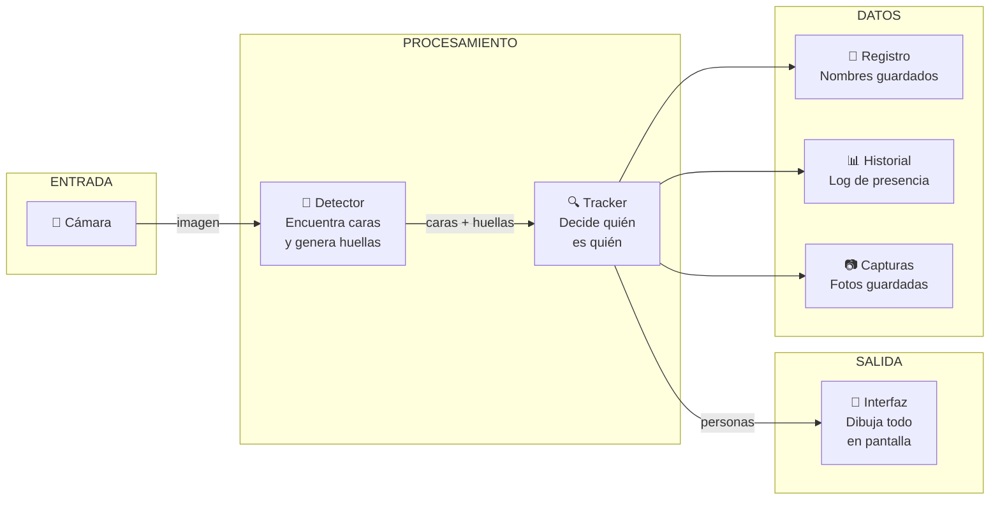
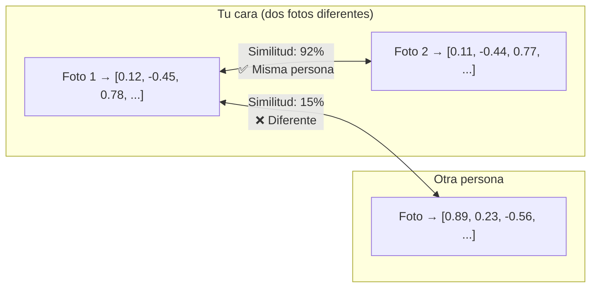
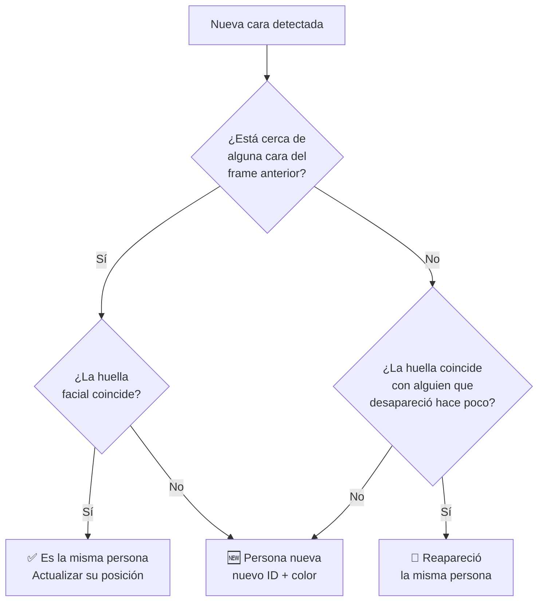
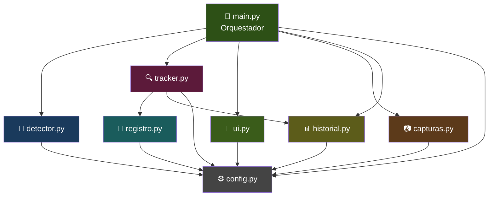

<div align="center">

# 🎯 Reconocimiento Facial en Tiempo Real

**Un sistema que abre tu cámara, detecta caras y sabe quién es quién — automáticamente.**

[](https://python.org)
[](https://opencv.org)
[](https://insightface.ai)
[](https://onnxruntime.ai)

---

</div>

## 📌 ¿Qué es esto y para qué sirve?

Imagina que abres un programa, se enciende tu cámara, y automáticamente:

- Si estás tú solo, dice **"Persona 1"** con un recuadro verde
- Si entra alguien más, dice **"Persona 2"** con un recuadro azul
- Si te vas y vuelves 5 minutos después, **te reconoce** como la misma persona
- Si le dices que te llamas "Franklin", la próxima vez que te vea dice **"Franklin"**

Todo esto pasa en tiempo real, sin que antes tengas que tomarle fotos a nadie, sin entrenar nada, sin configurar nada. Solo ejecutas y funciona.

---

## ⚡ Cómo empezar (en 2 pasos)

```bash
# Paso 1: Instalar lo que necesita
pip install -r requirements.txt

# Paso 2: Ejecutar
python src/main.py
```

Eso es todo. La primera vez tarda unos 30 segundos extra porque se descarga el "cerebro" de la IA (un modelo de 280MB). Solo pasa una vez, después arranca al instante.

---

## 🎮 Controles (qué teclas hacer mientras corre)

La app se controla con teclas del teclado mientras ves la ventana de la cámara:

<div align="center">

| Tecla | Qué pasa cuando la presionas |
|:-----:|------------------------------|
| `C` | 📷 **Captura** — Toma una foto del rostro de cada persona visible. La guarda con la fecha y hora en el nombre del archivo. |
| `S` | 🖼️ **Screenshot** — Guarda una foto de toda la pantalla tal cual se ve (con los recuadros, nombres, panel, todo). |
| `N` | ✏️ **Nombre** — Te pide un nombre en la terminal. Se lo asigna a la persona que está en cámara. Se guarda para siempre: la próxima vez que abras la app y esa persona aparezca, ya la llama por su nombre. |
| `G` | 🎬 **Grabar** — Empieza a grabar un video. Presiona G otra vez para detener. Se guarda como archivo .avi |
| `T` | 🎨 **Tema** — Cambia la interfaz entre modo oscuro y modo claro. |
| `R` | 🔄 **Reset** — Borra de la memoria a todas las personas que vio en esta sesión. Como si empezara de cero. (Los nombres guardados NO se borran.) |
| `Q` | ❌ **Salir** — Cierra la aplicación. |

</div>

---

## 🔧 Instalación paso a paso (explicado para alguien que nunca lo hizo)

### Qué necesitas tener antes

| Cosa | Por qué la necesitas |
|------|---------------------|
| **Python 3.9 o más nuevo** | Es el lenguaje en el que está escrito el proyecto. Si escribes `python --version` en la terminal y te sale 3.9, 3.10, 3.11, 3.12, 3.13 o 3.14, estás bien. |
| **Una cámara web** | El proyecto usa la cámara para ver caras en vivo. Puede ser la que viene en tu laptop o una USB externa. |
| **Internet** | Solo la primera vez que ejecutes. Descarga el modelo de inteligencia artificial (280MB). Después ya no necesitas internet. |

### Cómo instalar

1. **Abre una terminal** (PowerShell, CMD, o la terminal de VS Code)

2. **Navega a la carpeta del proyecto:**
   ```bash
   cd "ruta/donde/tengas/Reconocimiento_facial"
   ```

3. **Instala las dependencias:**
   ```bash
   pip install -r requirements.txt
   ```
   Esto descarga e instala 4 paquetes de internet. Tarda como 1-2 minutos.

4. **Ejecuta:**
   ```bash
   python src/main.py
   ```

### ¿Qué se instala exactamente?

El archivo `requirements.txt` le dice a pip que instale estas 4 cosas:

| Paquete | En palabras simples |
|---------|-------------------|
| **opencv-python** | La librería que sabe abrir cámaras, leer video, y dibujar cosas en pantalla (los recuadros, textos, colores) |
| **insightface** | El "cerebro": la inteligencia artificial que mira una cara y genera su huella facial única. También calcula edad y género. |
| **onnxruntime** | El "motor" que hace que la IA corra rápido en tu procesador sin necesitar tarjeta gráfica |
| **numpy** | La librería de matemáticas que compara las huellas faciales (calcula qué tan parecidas son dos caras) |

No necesitas instalar nada más. No necesita Visual Studio, no necesita CMake, no necesita compilar código C++. Todo se instala directo.

---

## 🧠 ¿Cómo funciona? (la lógica explicada para humanos)

### El concepto general

Piensa en cómo TÚ reconoces caras. Ves a alguien, tu cerebro procesa su cara, y "sabe" si es alguien que ya viste antes o si es un desconocido. Este programa hace exactamente lo mismo pero con matemáticas:

1. **Ve** la imagen de la cámara
2. **Encuentra** las caras dentro de la imagen
3. **Convierte** cada cara en un código numérico único (la "huella facial")
4. **Compara** ese código con los que ya tiene guardados
5. **Decide**: ¿es alguien que ya vi? ¿o es alguien nuevo?

### Arquitectura del sistema



---

### Paso 1: Detección — "¿Dónde hay caras?"

Lo primero que hace el sistema es mirar la imagen de la cámara y encontrar dónde están las caras. Esto lo hace un modelo de IA llamado **RetinaFace**.

**¿Qué hace exactamente?**
- Recibe la imagen completa de la cámara (640x480 píxeles)
- Busca patrones que parecen caras humanas
- Por cada cara que encuentra, devuelve:
  - Las **coordenadas** del rectángulo que encierra la cara (arriba-izquierda y abajo-derecha)
  - Un **nivel de confianza** (qué tan seguro está de que es una cara real, del 0% al 100%)
  - Los **landmarks** (puntos clave: ojos, nariz, boca)

**¿Por qué es bueno este modelo?**
- Funciona aunque la persona esté de perfil, con lentes, con mascarilla parcial
- Detecta múltiples caras a la vez (hasta 10)
- Es rápido (funciona en tiempo real sin GPU)

**En el código:** Esto está en `src/detector.py`

---

### Paso 2: Huella facial — "¿Cómo se ve ESTA cara específica?"

Una vez que encuentra una cara, necesita una forma de "recordarla". Para eso genera una **huella facial** (embedding).

**¿Qué es una huella facial?**

Es una lista de **512 números decimales** que representan matemáticamente tu cara. Piénsalo así:

- Tu cara tiene ciertas proporciones: distancia entre ojos, forma de la nariz, tamaño de la mandíbula, etc.
- El modelo ArcFace analiza todo eso y lo codifica en 512 números
- Esos 512 números son tu "DNI facial": únicos para ti

**¿Cómo funciona la comparación?**



- Dos fotos tuyas (incluso con distinta luz o ángulo) generan números **muy parecidos** → similitud alta (~90%)
- Tu cara vs otra persona genera números **muy diferentes** → similitud baja (~15%)
- El sistema dice "son la misma persona" si la similitud supera el 40% (configurable)

**¿Por qué 512 números?**
- Menos serían pocos para diferenciar personas parecidas
- Más serían innecesarios y lentos
- 512 es el punto justo donde ArcFace logra 99.5% de precisión

**En el código:** Esto está en `src/detector.py`, el modelo genera el embedding automáticamente para cada cara.

---

### Paso 3: Tracking — "¿Es la misma persona que vi antes?"

Aquí es donde se pone interesante. Cada vez que llega un nuevo frame (30 veces por segundo), el tracker tiene que decidir: ¿esta cara que veo ahora es la misma persona del frame anterior? ¿O es alguien nuevo?

**¿Cómo decide?** Usa dos estrategias combinadas:

#### Estrategia 1: Proximidad espacial
> "Si la cara está más o menos en el mismo lugar que hace un instante, probablemente es la misma persona"

Una persona no se teletransporta. Si en el frame anterior tu cara estaba en la posición (300, 200), en el siguiente frame probablemente está en (305, 198) — se movió un poquito. El tracker busca la detección más cercana a donde estaba antes.

#### Estrategia 2: Comparación de huellas
> "Si la huella facial coincide, CONFIRMO que es la misma persona"

La proximidad sola no basta (¿qué pasa si dos personas están juntas?). Entonces además compara las huellas faciales. Si la posición es cercana Y la huella coincide → es la misma persona con certeza.

#### ¿Qué pasa cuando alguien desaparece y vuelve?

Si te vas de la cámara, el tracker te "recuerda" por unos 15 frames (medio segundo). Si vuelves antes de eso, te reconoce por posición. Pero si vuelves después, te reconoce por tu huella facial: compara tu cara nueva con todas las que tiene en memoria y ve que coincides con alguien que ya había visto antes.



**En el código:** Esto está en `src/tracker.py`

---

### Paso 4: Registro — "¿Tiene nombre?"

Cuando el tracker identifica a una persona, consulta el registro: "¿Esta huella facial coincide con alguien que tenga nombre guardado?"

**¿Cómo funciona?**
1. Tú presionas `N` y escribes "Franklin"
2. El sistema toma la huella facial de esa persona (512 números) y la guarda en disco junto con el nombre
3. La próxima vez que abras la app, carga ese archivo
4. Cuando detecta una cara, compara su huella con todas las guardadas
5. Si coincide → muestra "Franklin" en vez de "Persona 1"

**¿Dónde se guarda?** En `datos/registro/personas_registradas.pkl` (un archivo binario de Python).

**En el código:** Esto está en `src/registro.py`

---

### Paso 5: Historial — "¿A qué hora estuvo?"

Cada vez que una persona aparece en cámara, el sistema anota la hora. Cuando desaparece, anota la hora de salida y calcula cuánto tiempo estuvo.

**¿Qué guarda?** Un archivo CSV con este formato:

```
persona, entrada, salida, duracion_segundos, fecha
Franklin, 14:23:05, 14:25:30, 145.0, 2026-07-27
Persona_2, 14:24:10, 14:24:55, 45.0, 2026-07-27
```

Puedes abrir ese CSV con Excel y ver un historial completo de quién estuvo frente a la cámara.

**En el código:** Esto está en `src/historial.py`

---

### Paso 6: Interfaz — "Cómo se ve todo"

La interfaz dibuja sobre cada frame de la cámara:

- **Recuadros con esquinas estilizadas** — cada persona tiene un color único
- **Etiqueta arriba** — nombre o ID + edad + género
- **Barra de tiempo** — una línea abajo del recuadro que crece según el tiempo en pantalla
- **HUD superior** — personas activas, total vistas, cuadros por segundo, reloj
- **Panel lateral** — miniaturas de cada persona con su info
- **Alertas** — aviso rojo cuando aparece alguien nuevo
- **Indicador de grabación** — "GRABANDO" cuando estás grabando video

También soporta dos temas (oscuro y claro) que se cambian con la tecla T.

**En el código:** Esto está en `src/ui.py`

---

### Paso 7: Capturas — "Guardar momentos"

Cuando presionas `C`:
1. El sistema recorta la zona del rostro de cada persona visible
2. Le agrega una barra debajo con: nombre + fecha + hora exacta
3. Lo guarda como archivo .jpg en `datos/capturas/`
4. El nombre del archivo incluye la fecha: `Franklin_2026-07-27_14-23-15.jpg`

Cuando presionas `S`:
- Guarda toda la pantalla tal como se ve (con interfaz incluida)

**En el código:** Esto está en `src/capturas.py`

---

### El hilo separado (threading) — "Que no se trabe"

La detección de caras con IA es pesada (toma unos milisegundos). Si la hiciéramos en el hilo principal, la imagen se vería trabada. Por eso el detector corre en un **hilo separado**:

- **Hilo principal**: lee la cámara → dibuja la interfaz → muestra en pantalla (fluido a ~30fps)
- **Hilo de detección**: analiza frames por separado → cuando termina, entrega los resultados

Así la imagen nunca se congela esperando a la IA.

**En el código:** Esto está en `src/detector.py` (la función `detectar_async`)

---

## 📁 Estructura del proyecto

```
Reconocimiento_facial/
│
├── src/                           ← Todo el código vive aquí
│   ├── main.py                    → Lo que ejecutas. Conecta todo.
│   ├── detector.py                → La IA: detecta caras + genera huellas faciales
│   ├── tracker.py                 → La lógica: decide quién es quién
│   ├── ui.py                      → Lo visual: dibuja todo lo que ves
│   ├── capturas.py                → Guardar fotos de rostros
│   ├── registro.py                → Guardar y buscar nombres
│   ├── historial.py               → Log CSV de presencia
│   └── config.py                  → Todos los ajustes en un solo lugar
│
├── datos/                         ← Se crea solo cuando usas la app
│   ├── capturas/                  → Fotos de rostros (tecla C)
│   ├── registro/                  → Nombres guardados (tecla N)
│   ├── historial/                 → CSV de presencia (automático)
│   └── grabaciones/               → Videos (tecla G)
│
├── requirements.txt               → Las 4 librerías que necesita
├── .gitignore                     → Lo que git no sube
└── README.md                      → Este archivo
```

### Relación entre módulos



---

## ⚙️ Configuración (qué puedes ajustar)

Todo se cambia editando un solo archivo: `src/config.py`

| Qué quieres cambiar | Variable | Valor actual | Qué pasa si lo subes | Qué pasa si lo bajas |
|:---------------------|:---------|:------------:|:---------------------|:---------------------|
| Sensibilidad de detección | `CONFIANZA_DETECCION` | `0.5` | Solo detecta caras muy claras | Detecta más caras pero puede confundir cosas con caras |
| Exigencia para reconocer | `UMBRAL_RECONOCIMIENTO` | `0.4` | Necesita que las huellas sean MUY parecidas para decir "es la misma persona" | Es más permisivo, puede confundir personas parecidas |
| Tiempo antes de olvidar | `FRAMES_PARA_PERDER` | `15` | Recuerda a alguien por más tiempo si desaparece | Olvida rápido |
| Frames para confirmar | `FRAMES_PARA_CONFIRMAR` | `3` | Necesita ver a alguien más tiempo antes de mostrarlo | Muestra personas más rápido pero puede haber parpadeos |
| Distancia de tracking | `DISTANCIA_MAX_TRACKING` | `150` | Permite más movimiento entre frames | Solo acepta movimiento pequeño |

---

## 🖥️ Opciones de ejecución (CLI)

Si quieres personalizar cómo arranca:

```bash
python src/main.py --camera 1              # Usar la segunda cámara
python src/main.py --tema claro            # Arrancar con interfaz clara
python src/main.py --no-panel              # Sin el panel lateral (más espacio)
python src/main.py --ancho 1280 --alto 720 # Mayor resolución
python src/main.py --threshold 0.5         # Más exigente al reconocer
python src/main.py --no-threading          # Sin hilo separado (debug)
python src/main.py --help                  # Ver todas las opciones
```

---

## 📊 Datos que genera la app

### Capturas de rostros (`datos/capturas/`)

Cuando presionas C se guardan archivos como:

```
Franklin_2026-07-27_14-23-15.jpg
Persona_2_2026-07-27_14-24-30.jpg
```

Cada imagen es el rostro recortado con una barra debajo que dice el nombre y la fecha/hora exacta.

### Historial de presencia (`datos/historial/historial_presencia.csv`)

Un archivo CSV que puedes abrir con Excel:

| persona | entrada | salida | duracion_segundos | fecha |
|---------|---------|--------|:-----------------:|-------|
| Franklin | 14:23:05 | 14:25:30 | 145.0 | 2026-07-27 |
| Persona_2 | 14:24:10 | 14:24:55 | 45.0 | 2026-07-27 |

### Registro de nombres (`datos/registro/`)

Un archivo binario que guarda la huella facial + nombre de cada persona registrada. Es lo que permite reconocer personas entre sesiones.

### Grabaciones (`datos/grabaciones/`)

Videos .avi que se crean cuando presionas G.

---

## 🛠️ Tecnología explicada

<div align="center">

| Capa | Qué tecnología usa | Qué problema resuelve |
|:----:|:-------------------:|:---------------------|
| 🔎 Detección | **RetinaFace** | "¿Dónde hay caras en esta imagen?" |
| 🧬 Reconocimiento | **ArcFace** (embedding 512D) | "¿De quién es esta cara?" |
| 👤 Demografía | **GenderAge** | "¿Qué edad tiene? ¿Hombre o mujer?" |
| ⚡ Motor de IA | **ONNX Runtime** en CPU | "Ejecutar los modelos rápido sin GPU" |
| 📹 Video | **OpenCV** | "Leer cámara, dibujar interfaz, grabar" |
| 🧮 Matemáticas | **NumPy** | "Comparar vectores de 512 números" |
| 🔀 Concurrencia | **Threading** (Python) | "Que la IA no trabe la imagen" |

</div>

Todo corre en **CPU**. No necesitas tarjeta gráfica NVIDIA ni nada especial.

---

## ❓ Preguntas frecuentes

<details>
<summary><b>¿Necesito crear un entorno virtual (venv)?</b></summary>
<br>
No es obligatorio. Funciona instalando directo. Pero si quieres aislarlo:

```bash
python -m venv venv
.\venv\Scripts\Activate.ps1   # Windows
pip install -r requirements.txt
```
</details>

<details>
<summary><b>¿Funciona sin internet?</b></summary>
<br>
Sí, después de la primera ejecución. El modelo se descarga una sola vez a <code>~/.insightface/models/</code> y queda guardado permanentemente.
</details>

<details>
<summary><b>¿Qué tan preciso es?</b></summary>
<br>
El modelo ArcFace tiene ~99.5% de precisión en el benchmark LFW (Labeled Faces in the Wild). En la práctica diferencia bien entre personas, incluso con cambios de iluminación o ángulo.
</details>

<details>
<summary><b>¿Por qué a veces confunde personas?</b></summary>
<br>
Puede pasar si dos personas son muy parecidas físicamente O si la iluminación es muy mala. Solución: subir el <code>UMBRAL_RECONOCIMIENTO</code> en config.py (de 0.4 a 0.5 o 0.6).
</details>

<details>
<summary><b>¿Los nombres se borran cuando cierro la app?</b></summary>
<br>
No. Los nombres que asignas con la tecla N se guardan en disco. Cuando vuelvas a abrir la app, las personas registradas se reconocen automáticamente.
</details>

<details>
<summary><b>¿Puedo usar esto para un sistema de asistencia?</b></summary>
<br>
Sí. El historial CSV registra hora de entrada y salida de cada persona. Con los nombres registrados, tienes un log completo de quién estuvo y cuándo.
</details>

<details>
<summary><b>¿Qué pasa si la cámara se desconecta?</b></summary>
<br>
La app intenta reconectar automáticamente hasta 3 veces antes de cerrarse.
</details>

---

## 🚀 Ideas para el futuro

- [ ] Interfaz web (ver desde el navegador o celular)
- [ ] Soporte GPU para más velocidad
- [ ] Múltiples cámaras simultáneas
- [ ] Notificaciones por Telegram cuando aparece alguien
- [ ] Exportar historial a Excel directamente
- [ ] Reconocer personas desde fotos (no solo en vivo)

---

<div align="center">

**Hecho con Python + OpenCV + InsightFace**

*Un proyecto de reconocimiento facial que funciona de verdad.*

</div>
